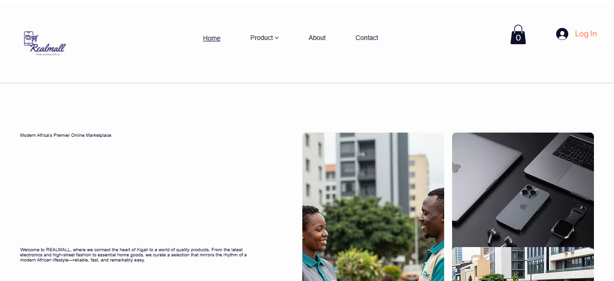
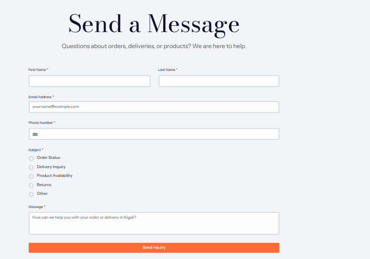

# RealMall - No-Code E-Commerce Website

## 👩‍🎓 Student Information
- Name: Ineza Deborah || Reg Number: 24039/2024
- Name: Niyorukundo Victoire || Reg Number: 19643/2022
- Course: E-Commerce and Web Application (EWA408510)
- Lecturer: Eric Maniraguha
- Academic Year: 2025-2026, Semester II
- Completion Date: June 08, 2026

## 📌 Project Title
RealMall - A Simple Online Store

## 🛠️ Platform Used
Wix (No-Code Website Builder)

## 🌐 Live Website Link
[Visit RealMall](https://niyorukundovictoir.wixsite.com/realmall)

## 📂 GitHub Repository Link
[GitHub Repository](https://github.com/yourusername/realmall)  

## ✨ Features Implemented
- Homepage with store name and welcome message
- Product page with at least 5 products (images, prices, descriptions)
- About page with store description and mission
- Contact page with email, phone, and contact form
- Cart interaction (basic add-to-cart simulation)

## 📸 Screenshots
*(Add screenshots in the `images/` folder and embed them here)*

- Homepage  
  

- Product Page  
  

- Contact/Cart Page  
  

  - About 
  

## 🚀 Challenges
- Learning how to customize Wix templates effectively
- Ensuring cart functionality worked smoothly
- Managing responsive design for mobile and desktop

## 📚 Lessons Learned
- No-code platforms like Wix make e-commerce development faster and easier
- Importance of clear product descriptions and visuals
- GitHub Markdown is powerful for structured documentation

## 🏆 Evaluation Criteria Mapping
- Website Design & Creativity ✅
- Product Pages & Content ✅
- UI/UX & Navigation ✅
- Cart Functionality ✅
- GitHub Documentation ✅
- Repository Organization ✅
